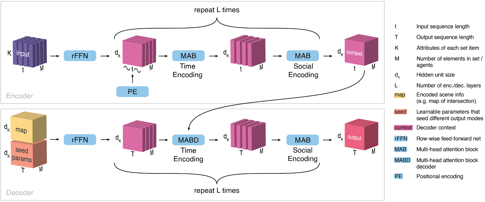

# UniTraj

**A Unified Framework for Cross-Dataset Generalization of Vehicle Trajectory Prediction**

UniTraj is a framework for vehicle trajectory prediction, designed by researchers from VITA lab at EPFL. 
It provides a unified interface for training and evaluating different models on multiple dataset, and supports easy configuration and logging. 
Powered by [Hydra](https://hydra.cc/docs/intro/), [Pytorch-lightinig](https://lightning.ai/docs/pytorch/stable/), and [WandB](https://wandb.ai/site), the framework is easy to configure, train and logging.
In this project, you will be using UniTraj to train and evalulate a model we call PTR (predictive transformer) on the data we have given to you.

## Installation

First start by cloning the repository:
```bash
git clone https://github.com/vita-epfl/unitraj-DLAV.git
cd unitraj-DLAV
```

Then make a virtual environment and install the required packages. 
```bash
python3 -m venv venv
source venv/bin/activate

# Install MetaDrive Simulator
cd ~/  # Go to the folder you want to host these two repos.
git clone https://github.com/metadriverse/metadrive.git
cd metadrive
pip install -e.

# Install ScenarioNet
cd ~/  # Go to the folder you want to host these two repos.
git clone https://github.com/metadriverse/scenarionet.git
cd scenarionet
pip install -e .
```

Finally, install Unitraj and login to wandb via:
```bash
cd unitraj-DLAV # Go to the folder you cloned the repo
pip install -e .
wandb login
```
If you don't have a wandb account, you can create one [here](https://wandb.ai/site). It is a free service for open-source projects and you can use it to log your experiments and compare different models easily.


You can verify the installation of UniTraj via running the training script:
```bash
python train.py method=ptr
```
The incomplete PTR model will be trained on several samples of data available in `motionnet/data_samples`.

## Code Structure
There are three main components in UniTraj: dataset, model and config.
The structure of the code is as follows:
```
motionnet
├── configs
│   ├── config.yaml
│   ├── method
│   │   ├── ptr.yaml
├── datasets
│   ├── base_dataset.py
│   ├── ptr_dataset.py
├── models
│   ├── ptr
│   ├── base_model
├── utils
```
There is a base config, dataset and model class, and each model has its own config, dataset and model class that inherit from the base class.

## Your Task
Your task is to complete the PTR model and train it on the data we have provided. 
The model is a transformer-based model that takes the past trajectory of the vehicle and its surrounding agents, along with the map, and predicts the future trajectory.

This is the architecture of the model. The model is implemented in `motionnet/models/ptr/ptr_model.py` and the config is in `motionnet/configs/method/ptr.yaml`. 
Take a look at the model and the config to understand the structure of the model and the hyperparameters.

You are asked to complete three parts of the model in `motionnet/models/ptr/ptr_model.py`:
1. The `temporal_attn_fn` function that computes the attention between the past trajectory and the future trajectory.
2. The `spatial_attn_fn` function that computes the attention between different agents at the same time step.
3. The encoder part of the model in the `_forward` function. 

You can find the instructions and some hints in the file itself. 

